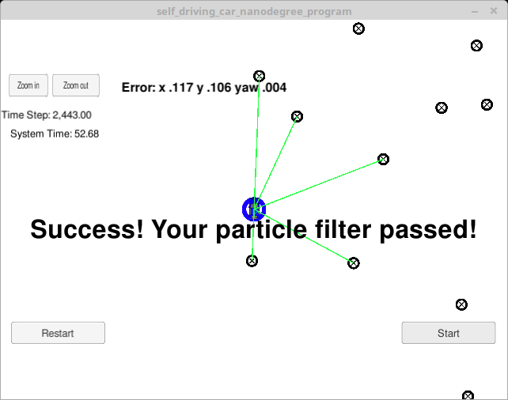

# Overview
This repository contains all the code needed to complete the Kidnapped Vehicle Project.

## Project Introduction
Your robot has been kidnapped and transported to a new location! Luckily it has a map of this location, a (noisy) GPS estimate of its initial location, and lots of (noisy) sensor and control data.

In this project you will implement a 2 dimensional particle filter in C++. Your particle filter will be given a map and some initial localization information (analogous to what a GPS would provide). At each time step your filter will also get observation and control data.

## Running the Code
This project involves the Term 2 Simulator which can be downloaded [here](https://github.com/udacity/self-driving-car-sim/releases)

Installing of uWebSocketIO is required, 

The main program can be built and ran by doing the following from the project top directory.

1. ./clean.sh
2. ./build.sh
3. ./run.sh

[Rubric goals](https://review.udacity.com/#!/rubrics/747/view) are to build out the methods in `particle_filter.cpp` until the simulator output says:

```
Success! Your particle filter passed!
```

# Implementing the Particle Filter

More about a particle filter can be found [here](https://en.wikipedia.org/wiki/Particle_filter)

## Success Criteria
If your particle filter passes the current grading code in the simulator (you can make sure you have the current version at any time by doing a `git pull`), then you should pass!

The things the grading code is looking for are:

1. **Accuracy**: your particle filter should localize vehicle position and yaw to within the values specified in the parameters `max_translation_error` and `max_yaw_error` in `src/main.cpp`.

2. **Performance**: your particle filter should complete execution within the time of 100 seconds.

# Results

We've implemented the particle filter and succsssfully tracked the position of the vehicle. Within 100 seconds, I was able to obtain the *Success! Your particle filter passed!* message and translation and yaw error was less that specified (0.116, 0.109, 0.004) in (x,y,yaw).

(Click to play video)
[](https://youtu.be/xtlfm_3F0YU "Click to Play Video")

## Sumamry
Does your particle filter localize the vehicle to within the desired accuracy? Yes, I obtained the success message in the sim.
Does your particle run within the specified time of 100 seconds? Yes, the sim runs within 60 seconds with the success message.
Does your code use a particle filter to localize the robot? Yes.


